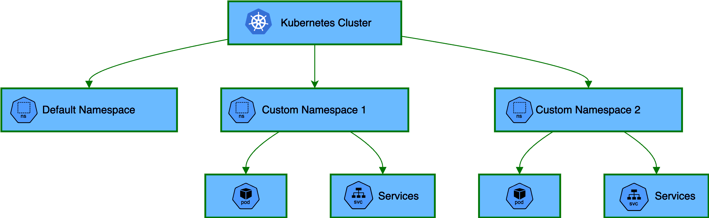

# 🔗 Kubernetes Namespace Management: Resource Isolation & Organization

[](https://github.com/TheToriqul/k8s-namespace)


## 📋 Project Overview

This project demonstrates my expertise in implementing and managing Kubernetes namespaces for resource isolation and multi-team workload organization. Through hands-on implementation, I've developed a comprehensive understanding of namespace management using both imperative commands and declarative YAML configurations, showcasing my ability to design and maintain segregated environments within Kubernetes clusters.

## 🎯 Key Objectives

- Implement resource isolation strategies using Kubernetes namespaces
- Master both imperative and declarative approaches to namespace management
- Deploy and manage workloads across different namespaces
- Develop expertise in namespace-based access control
- Establish best practices for multi-environment resource organization

## 🏗️ Project Architecture

<figure>
  <p align="center">
      
      <p align="center">Kubernetes Namespace Architecture</p>
  </p>
</figure>

The architecture demonstrates a Kubernetes cluster's namespace organization, featuring a default namespace alongside multiple custom namespaces. Each custom namespace encapsulates its own dedicated resources - including pods and services - enabling clear separation of workloads. This isolation pattern allows for independent resource management and access control while maintaining logical organization within the cluster.

## 💻 Technical Stack

- **Container Orchestration**: Kubernetes
- **Container Runtime**: Docker
- **Configuration**: YAML
- **Operating System**: Linux
- **Command Line Tools**: kubectl

## 🚀 Getting Started

<details>
<summary>🐳 Prerequisites</summary>

- Kubernetes cluster (local or cloud-based)
- kubectl CLI tool
- Basic understanding of YAML
- vim text editor (for configuration)

</details>

<details>
<summary>⚙️ Installation</summary>

1. Clone the repository:
   ```bash
   git clone https://github.com/TheToriqul/k8s-namespace.git
   ```
2. Navigate to the project directory:
   ```bash
   cd k8s-namespace
   ```
3. Ensure kubectl is properly configured:
   ```bash
   kubectl cluster-info
   ```

</details>

<details>
<summary>🎮 Usage</summary>

1. Create a new namespace:
   ```bash
   kubectl create namespace my-namespace
   ```
2. Deploy resources to the namespace:
   ```bash
   kubectl apply -f pod.yaml -n my-namespace
   ```

For detailed commands and explanations, refer to the [reference-commands.md](reference-commands.md) file.

</details>

## 💡 Key Learnings

### Technical Mastery:

1. Advanced namespace management strategies in Kubernetes
2. Resource isolation patterns and best practices
3. YAML-based declarative configuration
4. Multi-environment workload management
5. Namespace-based access control implementation

### Professional Development:

1. Infrastructure organization methodologies
2. Environment separation strategies
3. Resource management best practices
4. Documentation and standardization
5. DevOps workflow optimization

### 🔄 Future Enhancements

<details>
<summary>View Planned Improvements</summary>

1. Implement resource quotas per namespace
2. Add network policies for cross-namespace communication
3. Develop automated namespace cleanup procedures
4. Create namespace templates for different environments
5. Implement automated namespace provisioning
6. Add monitoring and logging segregation

</details>

## 🙌 Contribution

Contributions are welcome! Feel free to [open an issue](https://github.com/TheToriqul/k8s-namespace/issues) or submit a [pull request](https://github.com/TheToriqul/k8s-namespace/pulls) to suggest improvements or add features.

## 📧 Connect with Me

- 📧 Email: toriqul.int@gmail.com
- 📱 Phone: +65 8936 7705, +8801765 939006
- 🌐 LinkedIn: [@TheToriqul](https://www.linkedin.com/in/thetoriqul/)
- 🐙 GitHub: [@TheToriqul](https://github.com/TheToriqul)
- 🌍 Portfolio: [TheToriqul.com](https://thetoriqul.com)

Let's connect and discuss Kubernetes, DevOps, and cloud-native technologies!

## 👏 Acknowledgments

- [Poridhi](https://devops.poridhi.io/) for providing comprehensive learning resources
- The Kubernetes community for excellent documentation and support
- Fellow developers who contributed valuable feedback and suggestions

---

Thank you for exploring my Kubernetes Namespace Management project. I hope you find it informative and practical for your own journey in container orchestration! 🚀